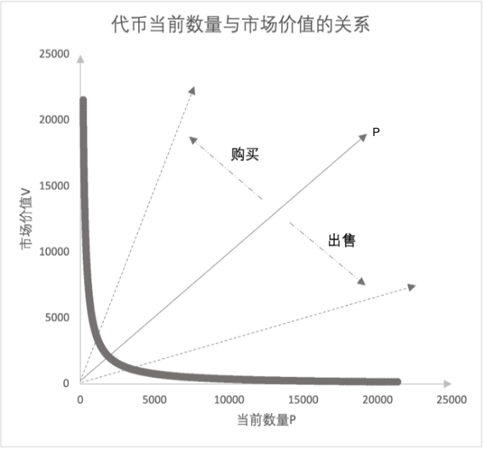
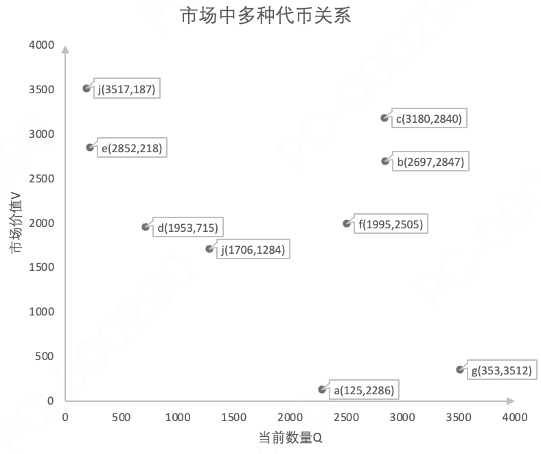
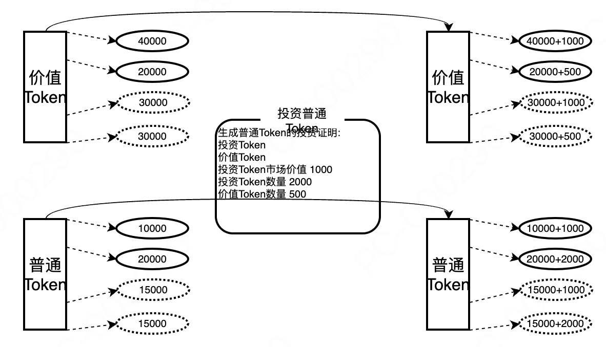
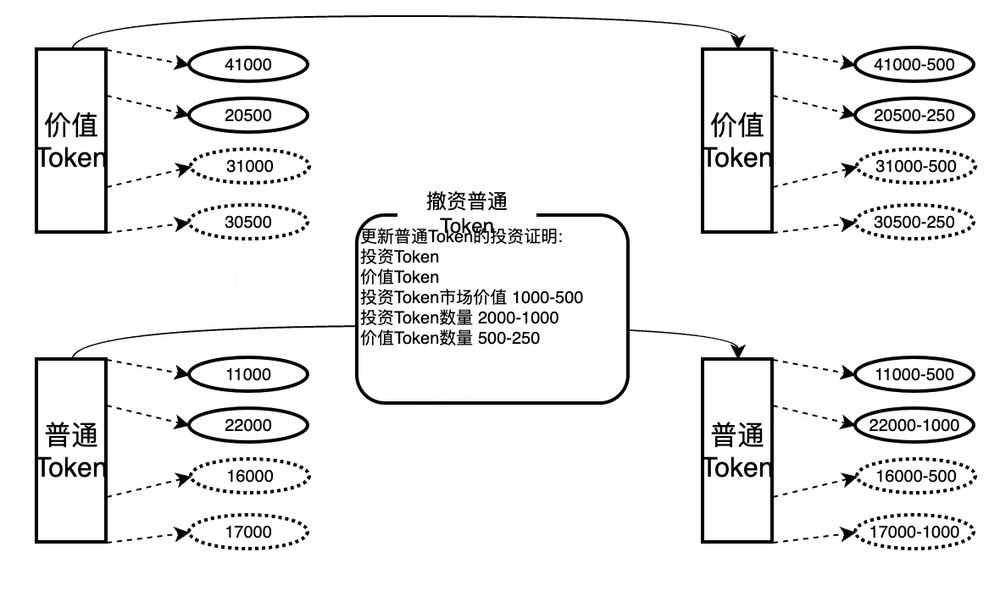

## ✅ 一 什么是 TTSWAP？
TTSWAP 是一个去中心化的代币交易平台，任何人都可以快速、安全地将一种代币兑换为另一种，无需依赖中心化交易所。
它的运行完全由智能合约驱动，不需要中间人，价格由协议交易自动决定。这种新型的机制被称为「恒定价值交易协议，它让交易过程更加透明、公平和稳定。  
### 💪你可以在 TTSWAP 上做什么？
1. **自由兑换任何代币**  
不需要通过中间币种（比如 USDT），你可以直接把 A 代币换成 B 代币，过程简单、迅速、无滑点。
2. **为代币无风险提供流动性,赚取收益**  
如果你看好某个代币，可以将它存入协议，获取手续费返佣和平台代币挖矿奖励；需要时无损取出。
3. **为TTSWAP提供流动性,二次挖矿TTS代币**  
给TTSWAP提供流动性，享受二次挖矿TTS，参与项目早期建设，将获得更高的回报。
4. **为TTSWAP拉新,永久享受手续费分佣**  
推荐关系存于代币合约，牢不可破也牢不可改，永久享受手续费分佣。
5. **为TTSWAP中代币进行运营,享受代币交易分红**  
为协议添加代币,成为代币的运营者，享受这个代币交易的手续费分佣。
6. **通过TTSWAP创建自己门户，为用户使用提供方便**  
为自己庞大私域流量提供高质量高标准的服务，获得服务收益。
7. **接入TTSWAP创建自己应用，状大ttswap生态**  
ttswap是一个开放的社区，允许开发者接入到自己的应用中，状大ttswap生态。 
8. **持有TTS代币,享受社区成长收益**  
TTS代币是目标导向型通缩代币.除市场上购买,参与公售,流动性挖矿途径外,其它途径获取的代币只有当价格上涨才能解锁.同时社区盈利部份均用于代币销毁,保护代币持有者权益.  
同时代币持有者拥有提案权,投票权和社区监督权.  
---
### 📘 小结
TTSWAP 致力于打造一个：
- 低交易成本
- 无中介
- 公平公开透明
- 鼓励共赢
 的 Web3 代币兑换平台。
## ✅ 二 为什么选择 TTSWAP？
TTSWAP 不仅能让你方便、安全地兑换代币，还具有以下 10 个优势，让你的每一次交易都更高效、更划算。  
### 🌐 1. 稳定价格，不怕滑点   
在 TTSWAP中，小额交易不会因价格波动导致“亏损”，你预估多少就能成交多少——交易体验更可控。  
### 💧 2. 所有代币共享流动性，交易更自由  
你不再需要一个个建立币对，也不用担心“池子太小流动性不够”。TTSWAP 让所有币对中的同一个代币共用一个**超级池子，交易更快、更顺畅**。  
### 🛡️ 3. 没有无常损失，LP更安心  
在其他平台，当你提供流动性时容易因为价格波动而亏钱，这叫**无常损失**。TTSWAP 的机制可以有效避免这个问题，你的投入不会减少。  
### ⛽ 4. Gas费节省 50%-90%  
智能合约结构精简，计算逻辑优化，让你每一笔交易都比在传统平台**省钱**——Gas 省得看得见。  
### 🔁 5. 直接支持 ETH，省去麻烦  
你可以直接用 ETH 交易，无需先换成 WETH（包裹ETH），一步到位更方便。  
### 💰 6. 每笔投资都可能挖矿（TTS）  
当你投入代币，系统会按你投入的价值自动计算并开始**二次挖矿**，赚取额外 TTS 奖励。  
### 🌱 7. 投资收益还能叠加 ETH 质押奖励   
把 ETH 投入 SETH / SWETH 池子后，系统会自动将未使用资金进行 Rocketpool 质押，享受年化**3~5%的额外回报**。  
### 📊 8. 人人可参与,手续费自动按角色分红  
你是用户、推荐者、门户、流动性提供者、代币运营者？都能获得一定比例的手续费分润，**人人可参与**。  
### 🧱 9. 模块化，灵活配置，轻松集成  
协议接口简单，调用方便，同时每个代币的参数、手续费、挖矿比率都可以**灵活设置**，为项目方和开发者提供更多自由度。  
### 💎 10. TTS代币是目标导向型通缩代币  
TTS发行总量固定,初始发行时均为锁定状态,**价格上涨才能解锁**.社区盈利均用于代币销毁,由代币持有者共同享受社区盈利.  
### 👥 11. 社区驱动，用户主导未来  
TTSWAP 不属于某个公司，它属于社区。**项目发展方向和奖励机制，由社区共识推动决定。** 

## ✅ 三 背后的运作逻辑是什么？  
### 🧠 1. 用一句话解释 
TTSWAP 的核心机制叫**恒定价值模型** ,又称之为多资产动态平衡模型，它确保每次代币交换时，双方的“总市场价值”是相等的，交易就像两边的天平，**你给出多少价值，就能换回同等价值的另一种代币**。

### 📊 2. 类比解释  
想象你去水果市场，用 10 块钱买苹果：
- 如果苹果贵，每斤 10 元，那你只能买 1 斤。
- 如果苹果便宜，每斤 5 元，你就能买 2 斤。 

TTSWAP 也是这样运作的。不同的是，它不是用法币定价，而是用**市场上已有的代币数量和价值**自动算出兑换比例。  
系统通过下面公式让价格随着供需变动，始终保持公平。

---
### ⚖️ 3. 计算原理是  
$$\begin{align}
    {V_a\over Q_a}*Δa={V_b\over Q_b}*Δb=...&={V_z\over Q_z}*Δz  \\
    交易前(V_a+V_b+....+V_z)&=交易后(V_a+V_b+....+V_z)  \\
    V_a:表示协议中Token_A&的市场价值  \\
    Q_a:表示协议中Token_A&的数量  \\
    Δa:表示协议中Token_A&的购买量或者出售量  \\
    V_b:表示协议中Token_B&的市场价值  \\
    Q_b:表示协议中Token_B&的数量  \\
    Δb:表示协议中Token_B&的购买量或者出售量  \\
    V_z:表示协议中Token_Z&的市场价值  \\
    Q_z:表示协议中Token_Z&的数量  \\
    Δz:表示协议中Token_Z&的购买量或者出售量  \\
\end{align}
$$
---
### 🔄 4. 如何计算交换比例？    
系统会根据：
- 每种代币在池子中的数量
- 每种代币当前的市场价值   
$$
\begin{align}
    获得Δb&={ {V_a \over Q_a}*Δa*Q_b \over V_b} 
\end{align}
$$
来决定：你要用多少 A 才能换回多少 B。  
> 💡 如果很多人都在买 Token A，它的“市场价值”会上升，换回的数量就会减少；反之，卖得多，它的价格会下降。

---
### 📐 5. 什么是“无滑点”和“交易阈值”？  
在 TTSWAP 中，如果你交易的金额小于**某个阈值**，系统就不会分批撮合，一次性按照当前价格成交。  
这就避免了“滑点”（即你本来以为能买10个，结果只买到9个的情况）。

---
### 🔄 6. 图文展示买卖流程  
- 价格P如何随着买入卖出变化

P会随着买卖行为发生变化  
- 【图2】为什么总价值保持不

一种代币减少的价值会转移到另一种代币上,因为总价值不会发生变化  
- 【图3】多种 Token 如何联动影响价格

当一种代币的P发生变化,那这种代币与其它代币的相对关系也会发生变化 
---

## ✅ 四 如何投资代币并赚收益？
在 TTSWAP 中，你不仅可以交易代币，还可以“存进去赚收益”。平台会根据你投入的代币，给予你 手续费分成 + TTS 挖矿奖励。

---
### 🔹 1. 每个代币有两个核心属性：
- 市场价值：当前市场认为这个代币值多少钱
- 数量：池子里还有多少这个代币  

> 💡 这两个数据决定了用户投资后能获得多少收益、以及兑换比例。

---
### 🧩 2. Token 分为三类，选择适合你的方式参与：  

| Token类型 | 是什么       | 能做什么 | 手续费收益| 是否支持单独投资 |
| --------- | ---------------------  | ------------------ | ------ |  ------ | 
| 🌱元Token   | 协议中添加的首个Token     | 作为流动性基础        |✅是           |✅可以                       |
| 🌟价值Token | 市场认可、有生态支撑的代币（如ETH）| 独立投资、独立赚钱   |✅是              | ✅可以    |
| 📦普通Token | 用户自己添加的代币，待市场验证     | 需要搭配价值Token一起投资      | ✅是 | ❌不可以单独 | 

---
### 💡 3. 怎么投资？
1. 选择你想支持的 Token
2. 投入一定数量的该代币（如果是普通Token，还需等值的价值Token一同投入）
3. 坐等收益：你将获得：
  - 每笔交易产生的手续费分红
  - 流动性挖矿获得的 TTS 代币

---
### 📤 4. 怎么撤资？   
你可以随时取回你投资的代币，同时系统会根据你的投资时间和比例，发放已累计的收益。    
> ⚠️ 为了防止突发大额撤资影响系统，单笔撤资不能超过当前池子的一定比例（称为“撤资切片”限制）。

---
### 🛡️ 5. 投普通 Token 为什么要配套价值 Token？  
因为普通 Token 价格波动大，容易被人套利。为了保护投资者，系统要求：
- 投入普通 Token 时，必须配对投入等值的“价值Token”
- 这两种 Token 会分别记录收益，你可以分别查看并提取

---
### 💵 6. 投资流程示意图
1. 你选择代币并输入数量
2. 系统根据市场价值计算对应投资价值
3. 投入成功，开始积累收益（手续费 + TTS）

## ✅ 五 你是怎么用 Token 换 Token 的？
TTSWAP 让你可以随时把手中的一种代币（比如 A）换成你想要的另一种（比如 B），而且交易过程不依赖中介，也不用挂单等待。

---
### 🔁 1. 交换逻辑：用“市场价值”衡量，而不是死板价格  

每种代币都有：  

- 当前池子中的数量（比如有多少个 A、多少个 B）  
- 当前的市场价值（这个币现在受欢迎吗？有人买吗？） 

系统会按照 “你给出的 Token 的市场价值 = 你换到的 Token 的市场价值” 来完成交易。   
**举个例子：**     
>你用 2500 个 A 去换 B，系统会计算这 2500 个 A 值多少钱（比如值 $100），然后再看看当前的 B 单价是多少（比如 1 B = $0.01），就会给你 10,000 个 B。

---

### 📉 2. 为什么越购买价格越高？  

每次你交换，都改变了池子的状态：

- 给出去的 Token 数量 **变多** → 它的市场价值 **变低**
- 收回的 Token 数量 **变少** → 它的市场价值 **变高**

所以你下次再来换，同样数量的 A，可能换不到那么多 B 了。  
> 💡 类比一下：就像你越买某个水果，摊主就越觉得这水果抢手，就会提价一样。

---

### 📊 3. 实时计算价格示意  

系统实际执行以下公式：  
$$
\begin{align}
   (Token A 市值 / 数量) × 你给出的数量
= (Token B 市值 / 数量) × 你能换到的数量 
\end{align}
$$
 
你不用背这个！只要知道它帮你保证交换是公平的，不会被黑箱定价。

---
### ⛽ 4. 每次交易后价格都会变化？   

是的，但**系统会把大交易切成多笔小交易**，让价格不会暴涨暴跌，避免你因为滑点吃亏。  
这也就是 TTSWAP 支持“无滑点交易”的核心逻辑：  
只要你交易金额没超过某个**阈值**（系统设定的“切片值”），每笔都是稳定价格成交。

---
**📘 补充说明：**  
- 所有交易都在链上自动计算完成，公开、透明、可验证
- 不需要等待撮合，不怕“订单撮不成”
- 不存在“机器人抢单”，你的交易按规则实时处理

---

## ✅ 六 怎么投、怎么赚、怎么退？

在 TTSWAP 中，除了交易代币，你还可以**通过“投资”赚手续费和 TTS 代币奖励**。这就像你在银行存钱，不但能拿利息，还有额外分红。  

---

### 💡 1. 什么是“投资”？

投资 = 把你的代币存入平台的池子，供其他用户交易使用，同时赚取收益。
 你存得越多、时间越长，赚得越多。
系统会记录两个核心数据：

- 📈 投资时的市场价值
- 📦 投入的代币数量

---

### 📌 2. 投资类型有两种

📌 投资类型有两种：  
|投资类型|	描述|	收益来源|	是否需要配对|
|----------|----------|--------|----|
|🌟 价值Token投资|	投入 ETH 等主流代币|	手续费分成 + TTS 挖矿|	否|
|🔍 普通Token投资|	投入新项目代币|	手续费分成 + TTS 挖矿|	✅需配对价值Token|

---

### 💰 3. 投进去后怎么赚收益？

系统会持续记录交易中产生的手续费，并将其按照你投资的比例分给你。  
同时你还会获得平台币 TTS 作为挖矿奖励。  
> ✅ 举个例子：你投入了 10% 的 ETH 池子份额，那你就能拿走这个池子产生的 10% 的手续费和奖励。

---

### ⛏️ 4. 什么是“构建手续费”？  

为保证公平，系统会记录你投入时对应的**构建手续费**(=投入数量*(总手续续/总投入数量))，这部分收益不算你的。  
只有在你投入后新产生的手续费，才是你的利润。

---

### 💼 5. 撤资怎么操作？能随时退吗？

你可以随时撤资，系统会根据你的投资比例和历史数据，计算你的收益并自动发放。
⚠️ 注意：
> 单笔撤资不能太大（系统会设定最大撤资比例），避免影响整个市场稳定。

---

**💡 投资普通Token的特别说明：**
- 因为普通Token波动较大，为了防止套利。
- 系统要求你必须同时投入等价值的“价值Token”（比如ETH）。
- 投入越多、时间越长，两边都能获得收益。
- 如果当普通代币价格归零时,对应的价值代币也无法撤出。

---

### 📌 6. 投资 示意图

1. 设置投入数量
2. 根据投入数量,计算需要的等价值的代币投入数量
3. 记录投资时两个代币的数量与市场价格价值,和对应的构建手续费
4. 记录投资时两个代币构建手续费

---

### 💵 7. 撤资 示意图

  

1. 设置撤资数量
2. 根据撤资数量,计算需要的等价值的代币撤资数量
3. 计算投资时两个代币的数量与市场价格价值
4. 计算两个代币的当前手续费与收益

## ✅ 七 手续费是怎么赚的？平台怎么分钱？
在 TTSWAP 中，每一次交易和投资都会产生手续费。这不是平台自己赚走，而是由系统自动分配给不同参与者，你只要参与，就有机会获得分润！

---
### 💸 1. 手续费从哪来？
每当有人：
- 进行交易（兑换 Token）
- 投资代币
- 撤资
系统就会按照一定比例，从这笔交易中扣除一部分作为手续费。

---
### 📊 2. 手续费怎么分？  
手续费并不被平台独吞，而是根据你在协议中的角色进行合理分配：  
| 角色身份 | 能获得手续费比例说明（示意） |
| --------- | --------------------- |
| 💧 流动性提供者 |	50%~80%（按投入占比分） |
| 🧑‍💼 服务商/门户 |	5%~25% |
| 👤 推荐者 |	5%~10% |
| 🧑‍🤝‍🧑 用户本人 |	专享10%折扣或奖励 |
| 🛠️ 代币管理员 |	分润1%~3% |     
| 🌐 社区和协议 | 	用于回购/销毁/开发资金等 |
>💡系统会根据是否填写推荐人、是否使用门户等条件，自动调整这些比例，确保公平透明。  

---
### 🧮 3. 投资者手续费是怎么算出来的？
关键词：单位手续费、构建手续费
当你投资后，系统记录：
- 当前总手续费是多少？
- 你的投入数量是多少？  
 
随着别人不断交易，系统手续费越来越多，你这部分就会产生利润。  
收益公式：  
$$
\begin{align}
收益 = 当前单位手续费 × 你的投资数量 - 构建手续费  
\end{align}
$$

> 💡构建手续费是你投资当时“历史手续费”的份额，不算进你的收益中，这样更公平。

---
### 📈 4. 多次投资也能合并收益？  
当然可以！系统会自动合并你在同一个池子的多次投资，把所有收益统一计算发放，你无需手动操作。

---
### 💼 5. 撤资时会自动发放收益吗？
是的。当你撤出投资：
- 系统会实时计算你应得的手续费收益
- 然后将“本金 + 收益”一次性打给你
并自动从池子中扣除你的份额，更新系统状态。

---
### 🧧 6. 手续费还能作为福利发放？
是的，项目方或代币发行方可以主动把部分 Token 存入手续费池中，用来：
- 提高年化收益率，吸引更多投资者
- 激励流动性提供者
- 举办活动福利

---
### 📚 7. 流程图说明   

- 图1：投资后手续费如何累积
- 图2：撤资时如何结算收益
- 图3：多笔投资如何合并计算
- 图4：推荐人/服务商手续费路径图

---

## ✅ 八 什么是流动性挖矿？越参与，挖得越多！
流动性挖矿 = 你投入代币 → 协议根据你贡献的“价值” → 分发平台代币（TTS）作为奖励。

---
### ⛏️ 1. 什么是“二次挖矿”？  
在 TTSWAP 上，你每次投资代币、提供流动性时，不光能赚手续费，还能自动参与平台代币 TTS 的挖矿。  
这叫“二次挖矿”，是额外赠送的奖励。    
> TTS 是平台发行的治理/激励代币，未来可用于投票、参与分润、交易等。

---
### 💧 2. 谁能参与挖矿？  
只要你把代币（任意代币）投入平台池子，**系统就会根据你投入的“市场价值”计算出算力**，从而获得 TTS 奖励。  
|你做的事|	奖励情况|
| ------------ | ------- |
|投入 ETH 等代币	|✅ 开始挖 TTS|
|投入普通代币|	✅ 也能挖（需配对价值Token）|
|越早投入|	✅ 奖励越多|
|投入越多	|✅ 奖励越高|

---
### 📊 3. 奖励规则是怎样的？  
- 每天发放**((2亿枚-已解锁数量)*2%/366天)**
- 系统会根据你当前算力（投入市场价值）占总算力的比例，来决定你能挖多少

**举个例子：**  
全网总投入是1000 USDT，你投入了100，那你当前就拥有10%的算力。  
系统发放1000 TTS，你就能分得 100 TTS。

---
### 🧠 4. 不用额外操作？完全自动？
对，你只需要：
- 把代币投入池子
- 剩下的事情交给智能合约自动完成
系统会自动：
- 分配手续费返佣
- 累积 TTS 挖矿奖励
- 你可以随时查看 & 提取

---
### 🎁 5. 挖到的 TTS 有什么用？  
- 可以用于 平台治理和投票
- 可以卖出换其他代币
- 可以参与未来生态激励活动
- 后续计划支持“锁仓增值”等更多玩法

---
### 📚 6. 图文说明 
- 图1：用户把 Token 存入池子
- 图2：系统按市场价值折算算力
- 图3：TTS 持续累积、可领取

---
### 📘 7. 小结  
**流动性挖矿 = 投入代币 → 累积收益 + 挖平台币 + 零操作门槛**  
**就像是“理财 + 矿机 + 自动提款机”三合一**

## ✅ 九 只质押一次 ETH，却能赚五份收益，怎么做到的？
你是否正在持有 ETH？在 TTSWAP 上，只要你将它质押一次，系统就能帮你自动开启**五条收益通道**，让你的 **ETH** 不再“闲着躺平”。

---
### 💰 1. 一次质押，五份收益
| 收益来源 |	描述|
| ----------| ------------------------------------ |
|① 手续费返佣 |	你作为流动性提供者，享受交易产生的手续费分润 |
|② TTS 挖矿奖励 |	系统根据你投入的 ETH 价值，分发平台币 TTS 奖励 |
|③ 验证者奖励 |	系统把未使用 ETH 流动性质押到 Rocketpool，获得验证奖励（年化约 3~5%） |
|④ rETH 池子返佣 |	得到的 rETH 会自动加入 rETH 池子，继续产生手续费返佣 |
|⑤ rETH 再挖矿收益 |	在 rETH 池子中继续参与 TTS 挖矿，收益叠加滚雪球 |

---
### 🧠 2. 整个过程全自动，不需你操作
你只需要做一件事：    
**把 ETH 或 WETH 存入对应池子（SETH 或 SWETH）**  

系统会自动完成：
- **Rocketpool 质押（获取 rETH）**
- **再质押 rETH（获取更多返佣和奖励）**
- **管理收益分发**

---
### 🧪 3. 为什么比普通质押收益高？     
传统 ETH 质押，只能拿到 3%~5% 验证者年化。  
TTSWAP 通过**组合池设计 + 自动复利**，实现收益叠加效果，**远超单一质押收益模型**。

---
### 🔗 4. 这项机制基于什么？
- Rocketpool：去中心化 ETH 质押协议
- rETH：Rocketpool 发放的质押凭证（含收益）
- SETH / SWETH：TTSWAP 内部 ETH/WETH 映射代币，支持用户参与并追踪

---
### 📚 5. 图解二次质押流程
 
a. 用户存入 ETH → SETH 池子  
b. 用户得到SETH池子的手续费分佣  
c. 用户得到SETH池子流动性挖矿TTS  
d. SETH 中未用部分 → Rocketpool 质押   
e. 用户得到验证者收益  
f. 获得 rETH → 存入 rETH 池子  
g. 用户得到rETH池子的手续费分佣  
h. 用户得到rETHTH池子流动性挖矿TTS  

**用户同时获得五份收益：**  
**- SETH池的手续费 +SETH池的挖矿 + 验证奖励 + rETH池的手续费 + rETH池的挖矿**

---
### 📘 6. 小结  
这是一个把你的 ETH 打造成“**收益发动机**”的方式：  
只做一次操作，系统自动帮你赚 5 重收入，不浪费任何机会。

## ✅ 十 谁参与，谁分润——TTSWAP的角色激励机制
TTSWAP 的核心理念是：**让每个为生态做出贡献的人，都能获得真实收益。**
无论你是用户、开发者、项目方、推荐者、门户运营方……只要你参与，都有你的一份奖励。

---
### 🎯 1. 系统角色和对应收益来源   
| 角色身份 | 能获得手续费比例说明（示意） |
| --------- | --------------------- |
| 💧 流动性提供者 |	50%~80%（按投入占比分） |
| 🧑‍💼 服务商/门户 |	5%~25% |
| 👤 推荐者 |	5%~10% |
| 🧑‍🤝‍🧑 用户本人 |	专享10%折扣或奖励 |
| 🛠️ 代币管理员 |	分润1%~3% |     
| 🌐 社区和协议 | 	用于回购/销毁/开发资金等 |

>💡 比例并非固定不变，具体分配方案由社区/代币持有人治理决定。

---
### 🔧 2. 后台配置说明（面向开发者/项目方）  
系统内部支持对每个角色的分润比例进行灵活设置，比如：  
|分润项 |	范围	|示例默认值 （可改）|
| ------- | ----- | -------- |
|投资者分佣	| 0% ~ 63% |	60%|
|商家分佣	| 0% ~ 63% |	2% |
|门户分佣	| 0% ~ 63% |	15% |
|推荐者分佣 |	0% ~ 63% |	10% |
|用户分润（折扣） |	0% ~ 63% |	5% |
|协议基本费率 |	0% ~ 63% |	3%|

这些参数都可以根据市场情况灵活调整.**平台支持可配置化市场激励机制，便于长期运行和公平分配。**

---
### 📌 3. 举个例子：一次交易手续费的分配路径  
假设用户 A 用 ETH 换了 B 代币，产生了 $10 手续费，配置如下：
- 投资者分佣：$5
- 推荐人（A 填写了你）分佣：$1
- 门户平台（比如接入的第三方 DApp）分佣：$1
- 用户折扣奖励：$1
- 协议收入：$2
> 💡  所有这些分润都由智能合约自动分配，你无需信任平台或中介。

---
### 📘 4. 小结  
TTSWAP 的市场激励机制建立在这样一个信念上：  
**“谁参与，谁共享。去中心化不只是技术，更是公平。”**  

## ✅ 十一 TTSWAP 交易更省钱，GAS消耗全透明
在以太坊等链上平台上，每一次操作（比如交易、质押、投资）都会消耗所谓的 “Gas 费”。  
Gas 越低，用户花费越少。  
TTSWAP 特别优化了合约结构和逻辑，使得用户在平台上的操作更省、更快、更轻便。

---
### 🧪 1.平均操作成本是多少？  
暂时无法在飞书文档外展示此内容  
>💡 首次调用通常会多一些初始化成本，后续操作费用显著减少。

---
### 💡 2.为什么 TTSWAP 能省这么多？   
相比其他 DEX 平台（如 Uniswap、Balancer 等），TTSWAP 的 Gas 成本可节省 50%~90%，原因包括：
- 智能合约逻辑更简洁（无多余计算）
- 核心函数高度复用（首次调用后缓存配置）
- 所有 Token 共用流动池（无需分币对）
>💡 你交易得多、操作得多，TTSWAP 帮你省的钱就越多。

---
### ⚙️ 3. 合约部署性能表现
- 合约体积：26543 字节（非常紧凑）
- 部署成本：约 5644297 Gas
- 采用模块化设计，利于审计、安全复用

---
### 📘 4. 小结  
在 TTSWAP 上：  
- 你能花更少的 ETH/Gas 完成更多操作  
- 不仅更经济，还更环保（减少链上负担）  
- 更适合高频交易、长期持仓用户使用  

---

## ✅ 第十二 你不仅是用户，更是平台共建者     

TTSWAP 并不是一个“官方操盘”的中心化平台，而是一个**所有用户都可以参与共建、共赢的开放协议**。  
你不是“客户”，你是“合伙人”。  
平台将所有参与者分成6类角色，每一类都能获得**真实的参与收益和社区权利。**

---

### 👤 1. 角色一览：谁都能参与其中  
|角色名称 |	你可以做什么？ |	你能获得什么？|
| --------- |------------------------|--------------|
|🛠️ 代币管理员 |	首次上线某个代币、设置参数、运营该 Token | 	获得该代币交易的手续费分润 1~3%|
|💧 流动性提供者 |	投入代币为平台提供交易池  | 	分得 50%~80% 的手续费 + 挖矿奖励|
|🧑‍💼 服务提供者	| 提供技术接口、集成钱包、做投资入口	 | 可获得手续费分润 5%~25%|
|👥 推荐者	| 推荐他人使用 TTSWAP	 | 可获得被推荐人手续费的 5%~10%|
|🙋‍♂️ 普通用户 |	使用平台进行交易、投资 | 	获得手续费折扣（默认 10%）|
|🌐 社区成员 |	参与项目治理、提出建议、投票 | 	拥有提案权、投票权和信息知情权|

---
### 🗳️ 2. 你的权利不仅是收益，还有决策权
代币持有者可以：
- 发起治理提案
- 对平台参数、激励机制、代币分发等重大事项投票
- 查看协议资金动向（全链上可查）    

> 这就是去中心化平台的核心精神：**参与即权利，持有即治理**

---
### 💡 3. 成为某个角色的方式非常简单：
- 想成为管理员？只需首次上线某个 Token
- 想成为推荐人？注册并分享你的邀请码
- 想赚服务分润？开发钱包、接入入口
- 想拥有治理权？持有 TTS 代币即可

---
### 📘 4. 小结   
TTSWAP 不仅仅是一个工具，更是一个可以一起共建、共享收益的开放社区。  
无论你是开发者、投资者、内容创作者，**你都能在这个系统中找到自己的价值角色。**  

---

## ✅ 十三 TTS代币怎么分？解锁规则像种菜游戏
TTS 是 TTSWAP 的平台币，用于治理、奖励和参与生态建设。为了保障每个人的长期利益，代币不是一拿就能卖，而是像“种菜”一样，需要“成熟”才可以“摘”。

---
### 📦 1. 总量和新增发行说明

- 📊 发行总量上限：2亿枚 TTS
- 🪙 初始铸造：5000万枚（全部锁仓，分配给不同贡献角色）
- 🔁 每年新增发行 =（2亿 - 当前解锁量）× 2%
- 🎯 新增代币用途：全部用于奖励流动性提供者，推动平台发展  
>💡 新增部分只用户流动性挖矿，不流向创始人或资本方，杜绝“超发砸盘”风险。该规则已经在合约中固定.

---
### 🌱 2. 简单版代币解锁规则（像种菜游戏）
**⚛️ 1️⃣ 基本规则**  
- 所有人拿到的代币一开始都是锁定的，不能立即使用。
- 解锁条件：代币价格涨到发放时的 2 倍（比如发的时候是 $0.05，得涨到 $0.10 才能开始解锁）。
- 每次最多解锁剩余部份的 20%，一次摘一小篮，不能一次全摘完。

---
**🧩 2️⃣ 四种角色分配方式**（就像游戏里的不同身份）
|角色	 | 是谁？ | 	解锁速度	 | 解锁规则	 | 举个例子🌰 |  
| ------- | ------------------- | ----- | -------------  | --------- |  
|👨‍🚀 创始人 | 	项目发起人，承担最多风险 | 	🐢 最慢 | 	每次涨1倍只能解锁 1/12 | 	1000 枚 → 首次解锁约 83 枚 | 
|🤝 合伙人A | 	核心骨干，早期参与 | 	🚲 慢 | 	每次解锁 1/10，离职仍可保留	 | 1000 枚 → 首次解锁 100 枚 | 
|🤝 合伙人B | 	持续付出的关键成员	 | 🏍 较快 | 	每次解锁 1/8，离职会被回收未解锁 | 	1000 枚 → 首次解锁 125 枚 | 
|💎 价值贡献者 | 	社区成员、技术/内容/运营支持者  | 	🚗 快 | 	每次最高解锁 1/6，不活跃会回收 | 	1000 枚 → 首次解锁 166 枚 | 
|💰 资本贡献者 | 投资人、早期得到空投用户	 | ✈️ 最快 | 	每次最高解锁 1/5，部分可立即流通 | 	1000   枚 → 首次解锁 200 枚 | 

---
**📌 3️⃣ 补充说明**
- 💡 采用谁受益谁负责：谁受益越多,谁负责越多,谁就与项目绑定越紧。
- ⚠️ 退出惩罚机制：合伙人B和贡献者如果中途离开，会失去未解锁部分。
- 🔄 可以升级：社区成员表现优秀，有机会晋升合伙人（像打游戏升 VIP）。
- 📈 币价实时监控：系统自动检测市场价格，涨到条件后才能“解锁”。

---
**🧲 4️⃣ 为什么要这样设计？**  
|目的	| 	实现方式	| 
|------- | ------ |
|防止砸盘跑路		| 未解锁部份大福多于解锁那部份,任何的抛售砸盘对于自己与其它持有者都不利	| 
|激励做贡献	| 	价值/合伙人比投资人解锁更灵活	| 
|促进生态增长		| 价格涨越多，解锁就越多	| 
|鼓励长期参与		| 每个角色都有解锁成长曲线	| 
|收益分配	| 更合理,更透明进行收益分配	| 

---
**❓ 5️⃣ 用户常问的问题**  
Q1: 如果币价一直不涨怎么办？  
 → 所有代币将持续锁定，解锁不了。团队就有动力去推动项目成功。  
Q2: 解锁后的币可以干嘛？  
 → 可以自由交易、参与投票、也能继续质押或投资。  
Q3: 这个机制会不会被操控？  
 → 不会，所有分配和解锁记录都公开在链上，透明可查，不能修改。  

---
### 📘 3. 小结  
TTS代币就像一棵你自己种的树，长得好，就能摘得多。

## ✅ 十四 开源透明合规，用户权益有保障
TTSWAP 是一个完全开源、合规运行的 Web3 项目，所有核心代码与文档均明确授权，并接受社区监督。

---
### 📂1.项目遵循两类开源协议：  
|协议类型|	用于哪些部分|	含义说明|
| -------- | ---------| ---------|
|🟩 MIT |	接口、工具、文档、部分合约 |	完全开源，可自由使用与商用|
|🟦 BUSL-1.1 |	核心智能合约 |	可用于学习与测试，商业应用需按协议授权|  

✅ BUSL-1.1  设定一定保护期，防止核心逻辑被恶意抄袭  
✅ MIT  保证开发者可自由引用非核心模块  

---
### 🔎 2. 项目文件结构透明开放
- 核心合约路径：/contracts/TTSwap_*
- 文档路径：/docs/whitepaper-cn.pdf 等
- 协议文件：详见 GitHub 中的 LICENSE 文件  

>💡 如果你发现任何可能侵犯第三方开源协议的内容，请立即联系我们，我们会积极响应处理。
## ✅ 十五 联系我们 & 加入社区
TTSWAP 是一个去中心化项目，欢迎全球用户、开发者、内容创作者、投资者一起加入共建。  
📣 不论你是想进行推广、参与挖矿、接入入口、运营社区或只是提建议，以下是我们官方唯一指定渠道：

---
### 🔗 1. 官方联系信息
|渠道 |	地址|
|-------|------|
|🌐 官网|	[ttswap.io](https://ttswap.io)|
|✉️ 邮箱|	[ttswap.exchange@gmail.com](mailto:ttswap.exchange@gmail.com)|
|🐦 Twitter |	[@ttswap_exchange](https://x.com/ttswap_exchange)|
|💬 Telegram|	[@ttswap01](https://t.me/ttswap01)|
|💻 Discord	| [ttswap0](https://discord.com/invite/XygqnmQgX3)|

---
### 🙌 2. 我们欢迎
- 📢 Web3内容创作者：加入传播TTSWAP理念
- 💻 开发者/技术团队：协助集成与工具建设
- 💰 投资人/资本方：共建长期可持续激励生态
- 🌍 全球社区成员：发声、建议、投票、参与决策

---
### 📘 3. 小结  

TTSWAP 不只是一个产品，而是一个由社区共同拥有、运营和受益的 Web3 公共协议。我们期待你的加入。
